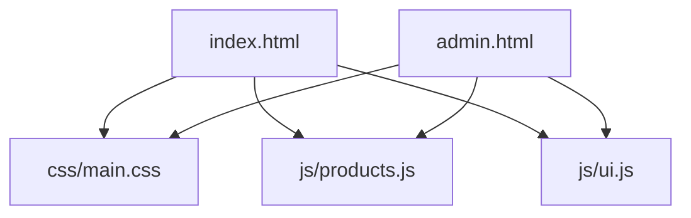

# 🐑 SHIELD SHEEP | AGENT CORE

> **Wear Your Faith** - Sistema de gestión y despliegue para la marca Shield Sheep.

---

## 🏗️ Estructura del Proyecto (Architecture)

El proyecto sigue una arquitectura monolitica ligera basada en archivos estáticos con lógica desacoplada en módulos de JavaScript.

### 📂 Directorios Clave
- `css/`: Estilos globales y variables de diseño.
- `js/`: Lógica de negocio (Productos, Carrito, Autenticación).
- `images/`: Recursos visuales de alta calidad.

---

## 🎨 Guía de Estilo (UI/UX Pro Max)

### Paleta de Colores
- **Oro (#d4af37)**: Representa la divinidad y la excelencia.
- **Rojo (#C1121F)**: Simboliza la pasión y el sacrificio.
- **Negro Puro (#000000)**: Fondo elegante y sobrio.

### Tipografía
- **Cinzel**: Para títulos y elementos de marca (Estilo antiguo/hebreo).
- **Montserrat**: Para cuerpo de texto y lectura clara.

---

## 🤖 Directrices para Agentes (Instructions)

Para mantener la integridad "Pro Max" del sistema, sigue estas reglas:

1.  **Refactorización**: Nunca dupliques lógica. Si una función se usa en `index` y `admin`, muévela a `js/ui.js`.
2.  **Estilos**: Usa variables CSS (`--oro`, `--rojo`) para mantener la coherencia.
3.  **Seguridad**: La autenticación actual es cliente-side (`localStorage`). Reportar si se requiere migración a Firebase/Backend.
4.  **Imágenes**: Siempre verifica que las rutas en `js/products.js` apunten a archivos existentes en `images/`.

---

## 🛠️ Funcionalidades Implementadas

- [x] **Gestión de Productos**: CRUD completo desde el panel administrativo.
- [x] **Simbolismo**: Cada producto incluye una descripción detallada de su significado.
- [x] **Pedidos Personalizados**: Integración directa con WhatsApp para cotizaciones.
- [x] **Portal de Inversores**: Sección protegida con clave para aliados estratégicos.
- [x] **Carrito Pro**: Persistencia en `localStorage` con feedback visual.

---

## 📈 Roadmap

- [ ] Integración con Pasarela de Pagos (e.g., PayU, MercadoPago).
- [ ] Backend en Node.js/Firebase para persistencia multi-dispositivo.
- [ ] SEO Avanzado para mercado internacional.

---
*© 2026 Shield Sheep. Desarrollado con ❤️ y Fe.*
